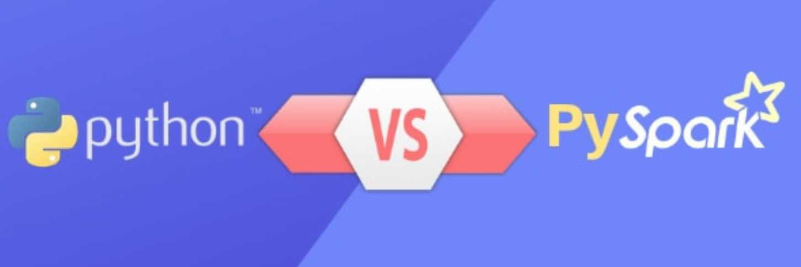

# Life of PySpark

[](https://opensource.org/licenses/Apache-2.0)

A Tale of Two Environments



An objective comparison of running [Spark](https://spark.apache.org/) on Scala vs. Python in both development and production environments.

{.center}

## Index

- [About](#about)
- [Introduction](#introduction)
- [Presentation](#introduction)
  - [Commands](#commands)
- [Demo](#usage)
  - [Commands](#commands)

###  Introduction


### Presentation

- Clone this repository

Run the following commands to:
 
- navigate the presentation directory
- install dependencies
- run the presentation

## Commands

```
$ cd presentation/reveal.js
```

```
$ npm install
```

```
$ npm start
```

### Demo


## Commands